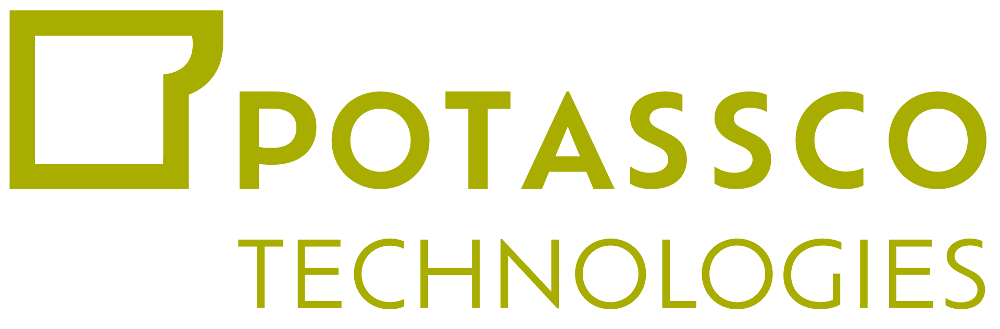

---
hide:
  - toc
---

# Community

!!! success "Potassco Community"
    *fillname* is part of the open source systems developed by:
    <!-- Potassco technologies logo -->
    

      
    

This is the central place for everything related to contributing, staying
up-to-date, and engaging with our project. Whether you’re here to collaborate,
explore the latest changes, or find support, we’ve got you covered.

## What’s Inside

- **Changelog:** Stay informed about the latest updates and improvements.
- **Contributing:** Learn how to get involved and make an impact on the
  project.
- **Development:** Dive into the technical details of how our system works.
- **Deployment:** Get guidance on setting up and deploying the system in
  various environments.
